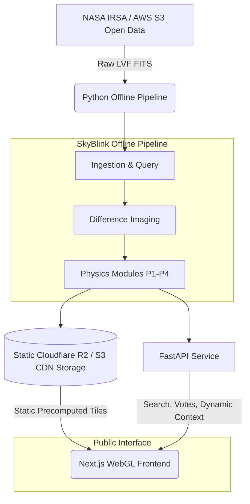
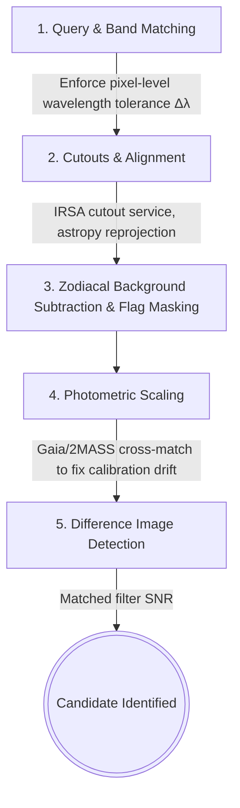
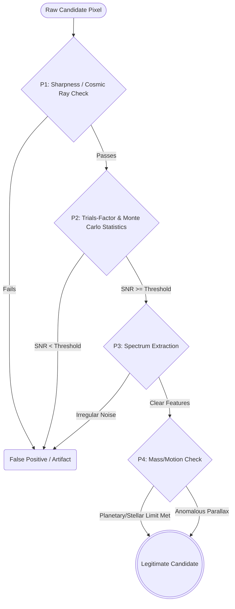

# SkyBlink | NASA Space Apps 2026: Planet X and SPHEREx

**A public-facing sky detective tool that reveals temporal celestial shifts, identifies moving targets using wavelength-matched difference imaging, and explains every anomaly using deep astrophysics.**

## The LVF Optics Problem
SPHEREx uses Linear Variable Filters (LVFs). Wavelength changes across the detector. Naively blinking two raw frames compares different colors, yielding false temporal artifacts.

## Our Solution
Same-position, same-wavelength, different-epoch matching.

---

## Architecture Overview



---

## Core User Modes & Features

- **Explorer Mode**: Jargon-free public UI. Pick a location, press Blink, see the sky change.
- **Detective Mode**: Advanced UI revealing candidates, multi-band spectra, and deep physics panels.
- **NEW: Localized Sphere Mapping (Geolocation)**: The application requests the user's current physical geolocation. It then calculates their local zenith and visible celestial sphere, automatically orienting the SPHEREx datasets to display the exact infrared sky directly above the user's real-world location.
- **3-Way Viewer**: Smooth WebGL-powered Blink, Swipe, and Difference viewing modes.
- **Follow-an-Object**: Ephemeris-forced tracking for known comets (e.g., 3I/ATLAS) and asteroids.

---

## Data Processing Pipeline



---

## The Physics Modules

1. **P1: Radiation & Detector Physics**: Particle hit rejection using Bethe-Bloch relations, "Sharpness" indexing, and PSF chi-square checks to filter out cosmic ray strikes.
2. **P2: High-Energy Statistics**: Trials-factor adjusted p-values and injection-recovery Monte Carlo simulations to prevent false positives in a field of a million pixels.
3. **P3: Quantum Spectroscopy**: 102-band interactive spectrum plots showing molecular vibrational modes (water, methane, CO, CO2) and isotope shifts directly from SPHEREx data.
4. **P4: Nuclear Physics Layer**: Mass-threshold slider demonstrating nuclear boundaries: Planets (no sustained fusion), Brown Dwarfs (deuterium burning > 13 $M_{Jup}$), and Stars.
   - **Planet X Detectability Calculator**: Accounts for $1/r^4$ reflected sunlight limits and 2 AU orbital parallax constraints.

---

## Physics Triage Decision Tree



---

## Tech Stack & Local Setup Instructions

### Tech Stack
- **Frontend**: Next.js, TypeScript, Tailwind, WebGL
- **Backend**: FastAPI
- **Pipeline**: Python, astropy, photutils

### Local Setup
Run the application using our automated makefiles:
```bash
make setup
make data
make pipeline
make demo
```

### Data Acknowledgment
*This tool utilizes simulated SPHEREx data based on official IRSA repositories. All uses of this tool must include the mandatory NASA SPHEREx data acknowledgment and QR2 DOI (`10.26131/IRSA652`).*
